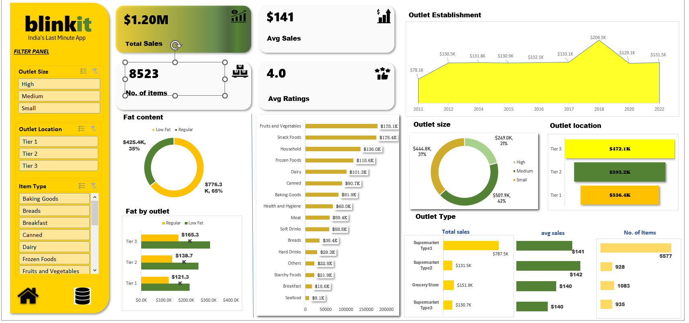

# BlinkIT Grocery Sales Dashboard
Excel sales dashboard for BlinkIT grocery data

## About
An interactive Excel dashboard built using BlinkIT 
grocery sales data to analyze sales performance 
across different outlets, locations and item types.

## Key Metrics
- Total Sales: $1.20M
- Average Sales: $141
- Number of Items: 8523
- Average Rating: 4.0

## What I Did
- Cleaned and analyzed raw grocery sales data
- Built interactive dashboard using Pivot Tables
- Added slicers for Outlet Size, Location and Item Type
- Visualized sales trends using charts and graphs
- Analyzed performance by outlet type and location

## Key Insights
- Total Sales: $1.20M across 8523 items
- Average Sales per outlet: $141
- Average Customer Rating: 4.0 out of 5
- Snack Foods is top selling category: $178.4K
  closely followed by Fruits & Vegetables: $178.1K
- Regular fat products dominate sales: 
  65% ($776.3K) vs Low Fat 35% ($425.4K)
- Tier 3 outlets lead location wise: $472.1K
- Small outlets have largest share: 42% ($507.9K)
- High size outlets contribute: 37% ($444.8K)
- Supermarket Type 1 is best performer: 
  $287.9K total sales, 5577 items
- Sales peaked in 2020 at $204.5K
- Lowest sales recorded in 2011: $78.1K

## Conclusion
- BlinkIT recorded total sales of $1.20M across 8523 items with a strong average rating of 4.0. Tier 3 outlets lead in sales at $472.1K showing strong demand in     developing markets. Regular fat content products dominate at 65% of total sales. Fruits & Vegetables is the top selling category at $178.1K followed closely by    Snack Foods at $178.4K. Supermarket Type 1 leads outlet performance with $287.9K in total sales. Outlet growth peaked in 2020 at $204.5K. Small outlets hold the   largest 
  share at 42% indicating wide reach at ground level.

## Tools Used
- Microsoft Excel
- Pivot Tables
- Charts and Slicers

## Data Source
BlinkIT Grocery Dataset (Kaggle)

## Dashboard Preview

## dashboard preview
![Dashboard] (dashboard.png)
